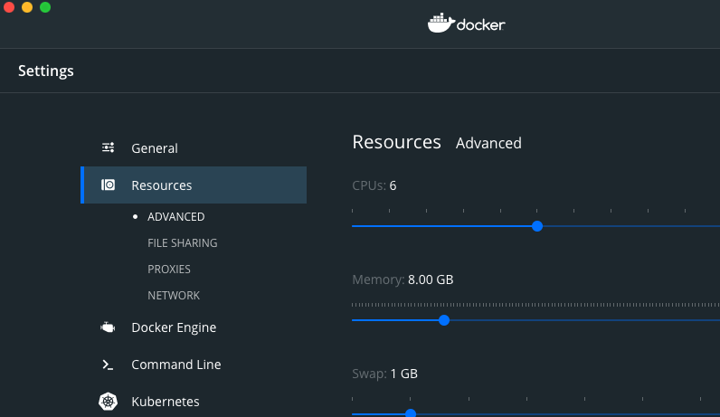

# K8GB - Kubernetes Global Balancer

## Project Health

[](https://opensource.org/licenses/MIT)
[](https://github.com/AbsaOSS/k8gb/actions?query=workflow%3A%22Golang+lint+and+test%22)
[](https://github.com/AbsaOSS/k8gb/actions?query=workflow%3AGosec)
[](https://github.com/AbsaOSS/k8gb/actions)
[](https://goreportcard.com/report/github.com/AbsaOSS/k8gb)
[](https://github.com/AbsaOSS/k8gb/actions?query=workflow%3A%22Helm+Publish%22)
[](https://hub.docker.com/r/absaoss/k8gb)

A Global Service Load Balancing solution with a focus on having cloud native qualities and work natively in a Kubernetes context.

- [Motivation and Architecture](#motivation-and-architecture)
- [Production Readiness](#production-readiness)
- [Installation and Configuration](#installation-and-configuration)
    - [Deployment How-To](#deployment-how-to)
    - [Local Playground Install](#local-playground-install)
        - [Environment prerequisites](#environment-prerequisites)
        - [Running project locally](#running-project-locally)
        - [Verify installation](#verify-installation)
        - [Run integration tests](#run-integration-tests)
        - [Cleaning](#cleaning)
- [Sample demo](#sample-demo)
    - [Round Robin](#round-robin)
    - [Failover](#failover)
- [Metrics](#metrics)
    - [General metrics](#general-metrics)
    - [Custom resource specific metrics](#custom-resource-specific-metrics)

## Motivation and Architecture

Please see the extended documentation [here](/docs/index.md)

## Production Readiness

k8gb is very well tested with the following environment options

| Type                            | Implementation                                     |
|---------------------------------|----------------------------------------------------|
| Kubernetes Version              | >= 1.14 (with install workaround) >= 1.15 (Stable) |
| Ingress Controller              | Nginx                                              |
| EdgeDNS                         | Infoblox                                           |
| Number of k8gb enabled clusters | 2                                                  |

## Installation and Configuration

### Deployment How-To

#### Prologue

For simplicity let's assume that you operate two geographically distributed clusters you want to enable global load-balancing for. In this example, two local clusters will represent those two distributed clusters.

* Let's switch the context to the first cluster
```sh
export KUBECONFIG=eu-cluster
```

* Copy the default `values.yaml` from k8gb chart to any convenient location, e.g.
```sh
cp chart/k8gb/values.yaml ~/k8gb/eu-cluster.yaml
```

* Modify the example configuration. Important parameters described below:
  * `ingressNamespace` - modify it to the namespace where the Nginx ingress controller is installed. In case of Rancher provisioned cluster it is `ingress-nginx`. If you do not have Nginx ingress preinstalled you can use `make deploy-local-ingress` to install and leave this value as `k8gb`
  * `dnsZone` - this zone will be delegated to the `edgeDNS` in your environment. E.g. `yourzone.edgedns.com`
  * `edgeDNSZone` - this zone will be automatically configured by k8gb to delegate to `dnsZone` and will make k8gb controlled nodes act as authoritative server for this zone. E.g. `edgedns.com`
  * `edgeDNSServer` stable DNS server in your environment that is controlled by edgeDNS provider e.g. Infoblox so k8gb instances will be able to talk to each other through automatically created DNS names
  * `clusterGeoTag` to geographically tag your cluster. We are operating `eu` cluster in this example
  * `extGslbClustersGeoTags` contains Geo tag of the cluster(s) to talk with when k8gb is deployed to multiple clusters. Imagine your second cluster is `us` so we tag it accordingly
  * `infoblox.enabled: true` to enable automated zone delegation configuration at edgeDNS provider. You don't need it for totally local test and can optionally skip it. Meanwhile in this how-to we will cover a fully operational end-to-end scenario. Support of other provider like Route53 is on our [Roadmap](https://github.com/AbsaOSS/k8gb/issues)
The other parameters do not need to be modified unless you want to do something special. E.g. to use images from private registry

* Export Infoblox related information in the shell. Instead of $ variables use the actual versions
```sh
export WAPI_USERNAME=<WAPI_USERNAME>
export WAPI_PASSWORD=<WAPI_PASSWORD>
```

* Create the Infoblox secret which is used by k8gb to configure edgeDNS by running:
```sh
kubectl create ns k8gb
make infoblox-secret
```

* Let's deploy k8gb to the first cluster. Most of the helper commands are abstracted by GNU `make`. If you want to look under the hood please check the `Makefile`. In general, standard Kubernetes/Helm commands are used. Point deployment mechanism to your custom `values.yaml`
```sh
make deploy-gslb-operator VALUES_YAML=~/k8gb/eu-cluster.yaml
```

* It should deploy k8gb pretty quickly. Let's check the pod status
```sh
 kubectl -n k8gb get pod
NAME                                                       READY   STATUS     RESTARTS   AGE
etcd-cluster-gnt7rslvvj                                    1/1     Running    0          20s
etcd-cluster-n8b2rvhv5q                                    0/1     Init:0/1   0          3s
external-dns-79d5ccd7fc-4bj74                              1/1     Running    0          39s
k8gb-76cc56b55-t779s                                       1/1     Running    0          39s
k8gb-coredns-799984c646-qz88m                              1/1     Running    0          41s
k8gb-etcd-operator-etcd-backup-operator-fccb8fdd-bx8v5     1/1     Running    0          40s
k8gb-etcd-operator-etcd-operator-765f655575-pgvbh          1/1     Running    0          40s
k8gb-etcd-operator-etcd-restore-operator-8977cd5c8-k8l7l   1/1     Running    0          40s
```

* As you can see one of the `etcd-cluster` pods is still in `Init` state. The embedded `etcd-operator` is automatically configuring isolated `etcd` cluster to act as a backend for `coredns` which is used as part of k8gb for coordinated DNS responses. Expected post installation result:
```sh
kubectl -n k8gb get pod
NAME                                                       READY   STATUS    RESTARTS   AGE
etcd-cluster-gnt7rslvvj                                    1/1     Running   0          7m39s
etcd-cluster-n8b2rvhv5q                                    1/1     Running   0          7m22s
etcd-cluster-xmkz8xsk7g                                    1/1     Running   0          6m41s
external-dns-79d5ccd7fc-4bj74                              1/1     Running   0          7m58s
k8gb-76cc56b55-t779s                                       1/1     Running   0          7m58s
k8gb-coredns-799984c646-qz88m                              1/1     Running   0          8m
k8gb-etcd-operator-etcd-backup-operator-fccb8fdd-bx8v5     1/1     Running   0          7m59s
k8gb-etcd-operator-etcd-operator-765f655575-pgvbh          1/1     Running   0          7m59s
k8gb-etcd-operator-etcd-restore-operator-8977cd5c8-k8l7l   1/1     Running   0          7m59s
```

* Deploy k8gb to the second cluster by repeating the same steps with the exception of:
  * Switch context to 2nd cluster with `export KUBECONFIG=us-cluster`
  * Create another custom `values.yaml` with `cp ~/k8gb/eu-cluster.yaml ~/k8gb/us-cluster.yaml`
  * Create another geo tag to enable cross cluster communication:
    * `clusterGeoTag` becomes `us`
    * `extGslbClustersGeoTags` becomes `eu`
  * Run the installation pointing to new values file `make deploy-gslb-operator VALUES_YAML=~/k8gb/us-cluster.yaml`

* When your 2nd cluster is ready by checking with `kubectl -n k8gb get pod`, we can proceed with the sample application installation

* We will use well known testing community app of [podinfo](https://github.com/stefanprodan/podinfo)
```sh
helm repo add podinfo https://stefanprodan.github.io/podinfo
kubectl create ns test-gslb
helm upgrade --install podinfo --namespace test-gslb --set ui.message="us" podinfo/podinfo
```
As you can see above we did set special geo tag message in podinfo configuration matching cluster geo tag. It is just for demonstration purposes.

* Check that podinfo is running
```sh
kubectl -n test-gslb get pod
NAME                       READY   STATUS    RESTARTS   AGE
podinfo-5cfcdc9c45-jbg96   1/1     Running   0          2m18s
```

* Let's create Gslb CRD to enable global load balancing for this application. Notice the podinfo Service name
```sh
kubectl -n test-gslb get svc
NAME            TYPE        CLUSTER-IP      EXTERNAL-IP   PORT(S)             AGE
podinfo         ClusterIP   10.96.250.84    <none>        9898/TCP,9999/TCP   9m39s
```

* Create a custom resource `~/k8gb/podinfogslb.yaml` describing `Gslb` as per the sample below:
```yaml
apiVersion: k8gb.absa.oss/v1beta1
kind: Gslb
metadata:
  name: podinfo
  namespace: test-gslb
spec:
  ingress:
    rules:
      - host: podinfo.cloud.example.com
        http:
          paths:
          - backend:
              serviceName: podinfo # This should point to Service name of testing application
              servicePort: http
            path: /
  strategy:
    type: roundRobin # Use a round robin load balancing strategy, when deciding which downstream clusters to route clients too
```

* And apply the resource in the target app namespace
```sh
kubectl -n test-gslb apply -f podinfogslb.yaml
gslb.k8gb.absa.oss/podinfo created
```

* Check Gslb resource
```sh
kubectl -n test-gslb get gslb
NAME      AGE
podinfo   39s
```

* Check Gslb resource status
```sh
kubectl -n test-gslb describe gslb
Name:         podinfo
Namespace:    test-gslb
Labels:       <none>
Annotations:  API Version:  k8gb.absa.oss/v1beta1
Kind:         Gslb
Metadata:
  Creation Timestamp:  2020-06-24T22:51:09Z
  Finalizers:
    finalizer.k8gb.absa.oss
  Generation:        1
  Resource Version:  14197
  Self Link:         /apis/k8gb.absa.oss/v1beta1/namespaces/test-gslb/gslbs/podinfo
  UID:               86d4121b-b870-434e-bd4d-fece681116f0
Spec:
  Ingress:
    Rules:
      Host:  podinfo.cloud.example.com
      Http:
        Paths:
          Backend:
            Service Name:  podinfo
            Service Port:  http
          Path:            /
  Strategy:
    Type:  roundRobin
Status:
  Geo Tag:  us
  Healthy Records:
    podinfo.cloud.example.com:
      172.17.0.10
      172.17.0.7
      172.17.0.8
  Service Health:
    podinfo.cloud.example.com:  Healthy
Events:                         <none>
```

* In the output above you should see that Gslb detected the `Healthy` status of underlying `podinfo` standard Kubernetes Service

* Check that internal k8gb DNS servers are responding accordingly on this cluster
  * Pick one of the worker nodes to test with
    ```sh
    k get nodes -o wide
    NAME                       STATUS   ROLES    AGE   VERSION   INTERNAL-IP   EXTERNAL-IP   OS-IMAGE       KERNEL-VERSION     CONTAINER-RUNTIME
    test-gslb2-control-plane   Ready    master   53m   v1.17.0   172.17.0.9    <none>        Ubuntu 19.10   4.19.76-linuxkit   containerd://1.3.2
    test-gslb2-worker          Ready    <none>   52m   v1.17.0   172.17.0.8    <none>        Ubuntu 19.10   4.19.76-linuxkit   containerd://1.3.2
    test-gslb2-worker2         Ready    <none>   52m   v1.17.0   172.17.0.7    <none>        Ubuntu 19.10   4.19.76-linuxkit   containerd://1.3.2
    test-gslb2-worker3         Ready    <none>   52m   v1.17.0   172.17.0.10   <none>        Ubuntu 19.10   4.19.76-linuxkit   containerd://1.3.2
    ```
  * Use `dig` to make a DNS query to it
    ```sh
    dig +short @172.17.0.10 podinfo.cloud.example.com
    172.17.0.8
    172.17.0.10
    172.17.0.7
    ```
  * One of your workers should already return DNS responses constructed by Gslb based on service health information
  * If edgeDNS was configured you can query your standard infra DNS directly and it should return the same
    ```sh
    dig +short podinfo.cloud.example.com
    172.17.0.8
    172.17.0.10
    172.17.0.7
    ```
* Now it's time to deploy this application to the first `eu` cluster. The steps and configuration are exactly the same. Just changing `ui.message` to `eu`
```sh
kubectl create ns test-gslb
helm upgrade --install podinfo --namespace test-gslb --set ui.message="eu" podinfo/podinfo
```

* Apply exactly the same Gslb definition
```sh
kubectl -n test-gslb apply -f podinfogslb.yaml
```

* Check the Gslb resource status.
```sh
k -n test-gslb describe gslb podinfo
Name:         podinfo
Namespace:    test-gslb
Labels:       <none>
Annotations:  API Version:  k8gb.absa.oss/v1beta1
Kind:         Gslb
Metadata:
  Creation Timestamp:  2020-06-24T23:25:08Z
  Finalizers:
    finalizer.k8gb.absa.oss
  Generation:        1
  Resource Version:  23881
  Self Link:         /apis/k8gb.absa.oss/v1beta1/namespaces/test-gslb/gslbs/podinfo
  UID:               a5ab509b-5ea2-49d6-982e-4129a8410c3e
Spec:
  Ingress:
    Rules:
      Host:  podinfo.cloud.example.com
      Http:
        Paths:
          Backend:
            Service Name:  podinfo
            Service Port:  http
          Path:            /
  Strategy:
    Type:  roundRobin
Status:
  Geo Tag:  eu
  Healthy Records:
    podinfo.cloud.example.com:
      172.17.0.3
      172.17.0.5
      172.17.0.6
      172.17.0.8
      172.17.0.10
      172.17.0.7
  Service Health:
    podinfo.cloud.example.com:  Healthy
Events:                         <none>
```

* Ideally you should already see that `Healthy Records` of `podinfo.cloud.example.com` return the records from __both__ of the clusters. Otherwise, give it couple of minutes to sync up

* Now you can check the DNS repsonses the same way as before.
```sh
dig +short podinfo.cloud.example.com
172.17.0.8
172.17.0.5
172.17.0.10
172.17.0.7
172.17.0.6
172.17.0.3
```

* And for the final end-to-end test, we can use `curl` to query the application
```sh
curl -s podinfo.example.com|grep message
  "message": "\"eu\"",

curl -s podinfo.example.com|grep message
  "message": "\"us\"",

curl -s podinfo.example.com|grep message
  "message": "\"us\"",

curl -s podinfo.example.com||grep message
  "message": "\"eu\"",
```

* As you can see specially marked `podinfo` returns different geo tags showing us the Global Round Robin strategy is working as expected

Hope you enjoyed the ride!

If anything unclear or is going wrong feel free to contact us at https://github.com/AbsaOSS/k8gb/issues. We will appreciate any feedback/bug report and Pull Requests are welcome.

For more advanced technical documentation and fully automated local installation steps, see below.

### Local Playground Install

#### Environment prerequisites

 - [install **GO 1.14**](https://golang.org/dl/)
 
 - [install **GIT**](https://git-scm.com/downloads)
    
 - install **gnu-sed** if you don't have it
    - If you are on a Mac, install sed by Homebrew
    ```shell script
    brew install gnu-sed
    ```
   
 - [install **Docker**](https://docs.docker.com/get-docker/)
    - ensure you are able to push/pull from your docker registry
    - to run multiple clusters reserve 8GB of memory
    
      
      <div>
        <sup>above screenshot is for <strong>Docker for Mac</strong> and that options for other Docker distributions may vary</sup>
      </div>

 - [install **Kubectl**](https://kubernetes.io/docs/tasks/tools/install-kubectl/) to operate clusters

 - [install **Helm3**](https://helm.sh/docs/intro/install/) to get charts

 - [install **kind**](https://kind.sigs.k8s.io/) as tool for running local Kubernetes clusters
    - follow https://kind.sigs.k8s.io/docs/user/quick-start/


#### Running project locally

To spin-up a local environment using two Kind clusters and deploy a test application to both clusters, execute the command below: 
```shell script
make deploy-full-local-setup 
```

#### Verify installation

If local setup runs well, check if clusters are correctly installed 

```shell script
kubectl cluster-info --context kind-test-gslb1 && kubectl cluster-info --context kind-test-gslb2
```

Check if Etcd cluster is healthy
```shell script
kubectl run --rm -i --tty --env="ETCDCTL_API=3" --env="ETCDCTL_ENDPOINTS=http://etcd-cluster-client:2379" --namespace k8gb etcd-test --image quay.io/coreos/etcd --restart=Never -- /bin/sh -c 'etcdctl  member list' 
```
as expected output you will see three started pods: `etcd-cluster`

```shell script
...
c3261c079f6990a7, started, etcd-cluster-5bcpvf6ngz, http://etcd-cluster-5bcpvf6ngz.etcd-cluster.k8gb.svc:2380, http://etcd-cluster-5bcpvf6ngz.etcd-cluster.k8gb.svc:2379
eb6ead15c2b92606, started, etcd-cluster-6d8pxtpklm, http://etcd-cluster-6d8pxtpklm.etcd-cluster.k8gb.svc:2380, http://etcd-cluster-6d8pxtpklm.etcd-cluster.k8gb.svc:2379
eed5a40bbfb6ee97, started, etcd-cluster-xsjmwdkdf8, http://etcd-cluster-xsjmwdkdf8.etcd-cluster.k8gb.svc:2380, http://etcd-cluster-xsjmwdkdf8.etcd-cluster.k8gb.svc:2379
...
```

Cluster [test-gslb1](deploy/kind/cluster.yaml) is exposing external DNS on default port `:5053` 
while [test-gslb2](deploy/kind/cluster2.yaml) on port `:5054`.
```shell script
dig @localhost localtargets.app3.cloud.example.com -p 5053 && dig -p 5054 @localhost localtargets.app3.cloud.example.com
```
As expected result you should see **six A records** divided between nodes of both clusters.
```shell script
...
...
;; ANSWER SECTION:
localtargets.app3.cloud.example.com. 30 IN A    172.17.0.2
localtargets.app3.cloud.example.com. 30 IN A    172.17.0.5
localtargets.app3.cloud.example.com. 30 IN A    172.17.0.3
...
...
localtargets.app3.cloud.example.com. 30 IN A    172.17.0.8
localtargets.app3.cloud.example.com. 30 IN A    172.17.0.6
localtargets.app3.cloud.example.com. 30 IN A    172.17.0.7
```
Both clusters have [podinfo](https://github.com/stefanprodan/podinfo) installed on the top. 
Run following command and check if you get two json responses.
```shell script
curl localhost:80 -H "Host:app3.cloud.example.com" && curl localhost:81 -H "Host:app3.cloud.example.com"
```

#### Run integration tests

There is wide range of scenarios which **GSLB** provides and all of them are covered within [tests](terratest).
To check whether everything is running properly execute [terratests](https://terratest.gruntwork.io/) :

```shell script
make terratest
```

#### Cleaning

Clean up your local development clusters with
```shell script
make destroy-full-local-setup
```


## Sample demo

### Round Robin

Both clusters have [podinfo](https://github.com/stefanprodan/podinfo) installed on the top where each 
cluster has been tagged to serve a different region. In this demo we will hit podinfo by `wget -qO - app3.cloud.example.com` and depending 
on region will podinfo return **us** or **eu**. In current round robin implementation are ip addresses randomly picked. 
See [Gslb manifest with round robin strategy](/deploy/crds/k8gb.absa.oss_v1beta1_gslb_cr.yaml)

Run several times command below and watch `message` field.
```shell script
make test-round-robin
```
As expected result you should see podinfo message changing

```text
{
  "hostname": "frontend-podinfo-856bb46677-8p45m",
  ...
  "message": "us",
  ...
}
```
```text
{
  "hostname": "frontend-podinfo-856bb46677-8p45m",
  ...
  "message": "eu",
  ...
}
```

### Failover

Both clusters have [podinfo](https://github.com/stefanprodan/podinfo) installed on the top where each 
cluster has been tagged to serve a different region. In this demo we will hit podinfo by `wget -qO - failover.cloud.example.com` and depending
on whether podinfo is running inside the cluster it returns only **eu** or **us**.
See [Gslb manifest with failover strategy](/deploy/crds/k8gb.absa.oss_v1beta1_gslb_cr_failover.yaml)

Switch GLSB to failover mode:
```shell script
make init-failover
```
Now both clusters are running in failover mode and podinfo is running on both of them.
Run several times command below and watch `message` field.
```shell script
make test-failover
```
You will see only **eu** podinfo is responsive:
```text
{
  "hostname": "frontend-podinfo-856bb46677-8p45m",
  ...
  "message": "eu",
  ...
}
```
Stop podinfo on **current (eu)** cluster:
```
make stop-test-app
```
Several times hit application again
```shell script
make test-failover
```
As expected result you should see only podinfo from **second cluster (us)** is responding:
```text
{
  "hostname": "frontend-podinfo-856bb46677-v5nll",
  ...
  "message": "us",
  ...
}
```
It might happen that podinfo will be unavailable for a while due to 
[DNS sync interval](https://github.com/AbsaOSS/k8gb/pull/81) and default k8gb DNS TTL of 30 seconds  
```text
wget: server returned error: HTTP/1.1 503 Service Temporarily Unavailable
```
Start podinfo again on **current (eu)** cluster:
```shell script
make start-test-app
```
and hit several times hit podinfo:
```shell script
make test-failover 
```
After DNS sync interval is over **eu** will be back
```text
{
  "hostname": "frontend-podinfo-6945c9ddd7-xksrc",
  ...
  "message": "eu",
  ...
}
```
Optionally you can switch GLSB back to round-robin mode
```shell script
make init-round-robin
```
## Metrics

K8GB generates [Prometheus][prometheus]-compatible metrics.
Metrics endpoints are exposed via `-metrics` service in operator namespace and can be scraped by 3rd party tools:

``` yaml
spec:
...
  ports:
  - name: http-metrics
    port: 8383
    protocol: TCP
    targetPort: 8383
  - name: cr-metrics
    port: 8686
    protocol: TCP
    targetPort: 8686
```

Metrics can be also automatically discovered and monitored by [Prometheus Operator][prometheus-operator] via automatically generated [ServiceMonitor][service-monitor] CRDs , in case if [Prometheus Operator][prometheus-operator]  is deployed into the cluster.

### General metrics

[controller-runtime][controller-runtime-metrics] standard metrics, extended with K8GB operator-specific metrics listed below:

#### `healthy_records`

Number of healthy records observed by K8GB.

Example:

```yaml
# HELP k8gb_gslb_healthy_records Number of healthy records observed by K8GB.
# TYPE k8gb_gslb_healthy_records gauge
k8gb_gslb_healthy_records{name="test-gslb",namespace="test-gslb"} 6
```

#### `ingress_hosts_per_status`

Number of ingress hosts per status (NotFound, Healthy, Unhealthy), observed by K8GB.

Example:

```yaml
# HELP k8gb_gslb_ingress_hosts_per_status Number of managed hosts observed by K8GB.
# TYPE k8gb_gslb_ingress_hosts_per_status gauge
k8gb_gslb_ingress_hosts_per_status{name="test-gslb",namespace="test-gslb",status="Healthy"} 1
k8gb_gslb_ingress_hosts_per_status{name="test-gslb",namespace="test-gslb",status="NotFound"} 1
k8gb_gslb_ingress_hosts_per_status{name="test-gslb",namespace="test-gslb",status="Unhealthy"} 2
```

Served on `0.0.0.0:8383/metrics` endpoint

### Custom resource specific metrics

Info metrics, automatically exposed by operator based on the number of the current instances of an operator's custom resources in the cluster.

Example:

```yaml
# HELP gslb_info Information about the Gslb custom resource.
# TYPE gslb_info gauge
gslb_info{namespace="test-gslb",gslb="test-gslb"} 1
```

Served on `0.0.0.0:8686/metrics` endoint

[prometheus]: https://prometheus.io/
[prometheus-operator]: https://github.com/coreos/prometheus-operator
[service-monitor]: https://github.com/coreos/prometheus-operator#customresourcedefinitions
[controller-runtime-metrics]: https://book.kubebuilder.io/reference/metrics.html
