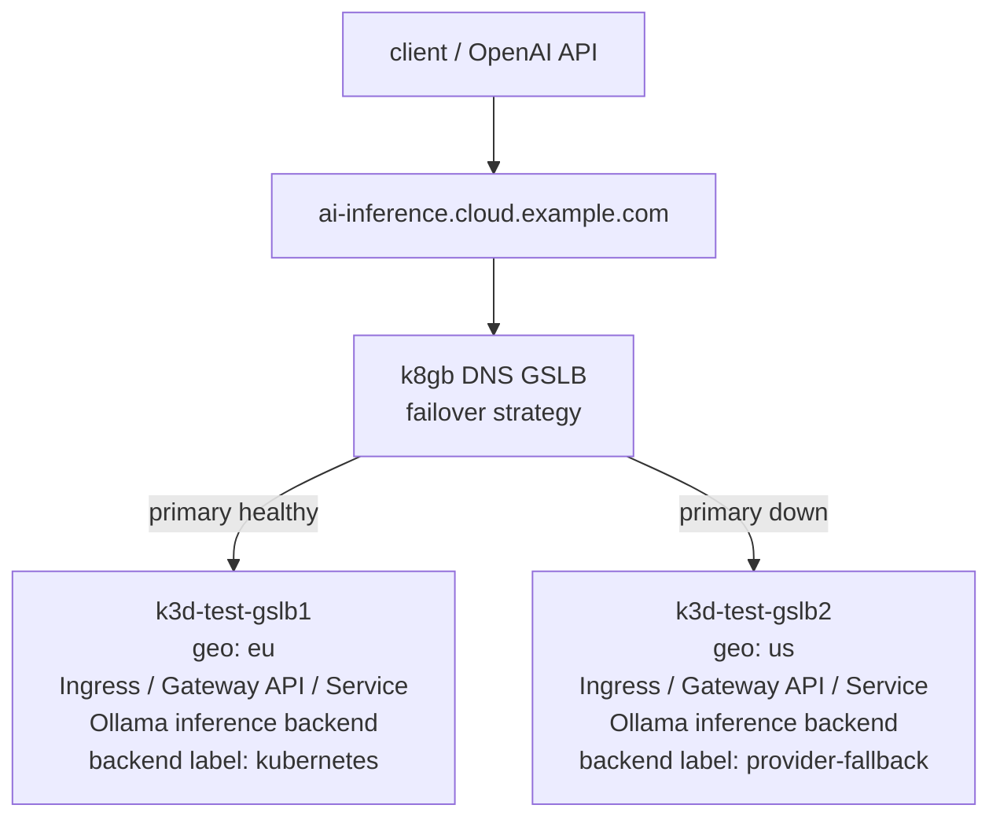

# AI Inference Resilience Demo

This demo shows k8gb as a global resilience layer for AI inference endpoints.



The demo runs real local inference by default. It deploys Ollama in each cluster, pulls a small model, creates a region-specific OpenAI-compatible model, and probes the same global hostname during failover and failback.

The k8gb topology is backend-agnostic. The same diagram applies if the regional inference backend is Ollama, vLLM, KServe, Triton, Ray Serve, a provider proxy, or any OpenAI-compatible gateway. k8gb owns global health-aware DNS routing; the inference server behind the regional `Service` is replaceable.

The local demo uses Kubernetes `Ingress` because the k3d setup already includes nginx ingress and it keeps the demo one-command. Treat that as local demo plumbing. The production-facing pattern is k8gb `Gslb` plus `spec.resourceRef`, which can point at `Ingress`, Gateway API `HTTPRoute`, LoadBalancer `Service`, Istio `VirtualService`, and other supported route resources.

## Positioning With AI Gateways

k8gb does not replace Envoy Gateway, Envoy AI Gateway, Istio, KServe, vLLM, Triton, LiteLLM, or other AI inference gateways. Those systems remain responsible for in-region L7 traffic concerns such as authentication, TLS, retries, rate limits, token accounting, request mutation, model routing, provider adapters, canary routing, and telemetry.

k8gb adds the global resilience layer above them. It publishes a global DNS name and returns healthy regional endpoints according to the configured strategy. A typical production path is:

```text
client -> k8gb global DNS name -> regional gateway or service -> inference backend
```

Use k8gb with the platform gateway that already owns regional traffic:

- Envoy Gateway or Envoy AI Gateway: reference the Gateway API route, such as `HTTPRoute`, that fronts the inference gateway.
- Istio: reference the `VirtualService` and keep Istio policies inside the region.
- Direct model serving or provider proxy: reference the `Ingress`, Gateway API route, or LoadBalancer `Service` that exposes it.

The positioning is complementary: regional gateways optimize and govern each request; k8gb keeps the global hostname reachable when a cluster, region, gateway, or inference backend stops being healthy.

## Why k8gb Matters Here

AI inference fails in practical ways: GPU pools run hot, clusters get drained, gateways misbehave, cloud regions degrade, provider quotas bite, and model backends become slow or unavailable. If all fallback logic lives inside one region, that logic cannot save users when the regional entrypoint itself is unhealthy.

k8gb gives the inference endpoint a global failure boundary. Clients keep using one stable hostname. k8gb checks the Kubernetes-backed regional endpoints and stops returning a failed region when the referenced service has no healthy backend. Traffic moves to a healthy cluster, region, or provider-backed endpoint without every client SDK implementing its own regional failover logic.

That is the useful AI inference angle: not faster tokens, not smarter model routing, and not another AI gateway. k8gb is the global availability layer that keeps an inference hostname reachable when the local serving stack cannot.

## Quick Demo

Deploy the local k3d setup:

```sh
K8GB_LOCAL_VERSION=test make deploy-full-local-setup
```

Run the full AI inference failover demo:

```sh
make ai-inference-demo
```

The script deploys the endpoint to both clusters, probes the global hostname, scales the primary endpoint down, waits for failover to the secondary endpoint, restores the primary, and waits for failback.

Expected flow:

```text
eu -> us -> eu
```

Example output:

```text
content=eu,kubernetes,k8gb
content=us,provider-fallback,k8gb
content=eu,kubernetes,k8gb
```

The default model is `qwen2.5:0.5b`, wrapped as `k8gb-resilient-demo:latest`.

## Useful Actions

The demo uses one Make target. Change behavior with `AI_DEMO_ACTION`.

```sh
make ai-inference-demo AI_DEMO_ACTION=status
make ai-inference-demo AI_DEMO_ACTION=probe
make ai-inference-demo AI_DEMO_ACTION=failover
make ai-inference-demo AI_DEMO_ACTION=failback
make ai-inference-demo AI_DEMO_ACTION=logs
make ai-inference-demo AI_DEMO_ACTION=delete
```

Notes:

- First run needs internet access from the cluster for the model pull.
- Ollama uses a `2Gi` PVC to cache model data.
- Probes default to one request because local CPU inference is intentionally lightweight but still slower than a static endpoint.

## What Gets Deployed

The demo creates:

- Namespace: `ai-inference-demo`
- Deployment: `ai-inference-demo`
- Service: `ai-inference-demo`
- Route resource: local `Ingress` named `ai-inference-demo`
- Gslb: `ai-inference-demo`
- PersistentVolume: `ai-inference-demo-ollama-<region>`
- PersistentVolumeClaim: `ai-inference-demo-ollama`

The global endpoint is:

```text
http://ai-inference.cloud.example.com/v1/chat/completions
```

## Real Clusters

Use explicit contexts and a real DNS zone:

```sh
CONTEXTS="prod-eu:eu:kubernetes prod-us:us:provider-fallback" \
PRIMARY_CONTEXT=prod-eu \
PROBE_CONTEXT=prod-eu \
PRIMARY_GEO_TAG=eu \
GSLB_DOMAIN=example.com \
./hack/ai-inference-demo.sh run
```

For production, keep the k8gb `Gslb` and `resourceRef` pattern and replace the demo route object with the platform standard. Prefer Gateway API `HTTPRoute` for new HTTP deployments when the cluster has a Gateway implementation. Keep `Ingress` only where it is already the supported cluster ingress path.

## Message

> k8gb keeps AI inference endpoints globally reachable across regions, clusters, and providers.

This is an availability and resilience demo, not an LLM performance benchmark.
