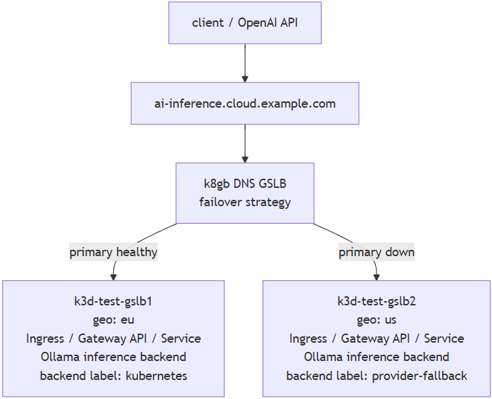

---
date:
  created: 2026-05-29
authors:
  - elohmrow
categories:
  - Technical Deep Dive
tags:
  - k8gb
  - ai
  - inference
  - resilience
  - failover
---

# AI Inference Needs a Global Resilience Layer

## Background: AI Inference

First, some background. What is AI inference?

When you ask ChatGPT "Can you explain [X] to me?", what happens? A server
somewhere converts that question to tokens and passes them through some trained
model. The model performs a lot of calculations, generating a response, token by
token, until it has a complete answer, which it then somehow delivers to you.

> Note: we're _not_ talking about training a model here; rather, about using an
already-trained model.

<!-- more -->

## The Problem

So what could go wrong with that process? 

Well, AI workloads are different from `normal` workloads.

In AI workloads, _state_ and _locality_ matter. Think: model version, context,
etc. We need to route your question to a specific place, not just any healthy 
endpoint. This may not always be the _nearest_ place, so we can bump up against 
latency tradeoffs.

AI workloads are _heavy_ and _expensive_. GPU is bound, capacity is limited / uneven 
at different locations. Where GPUs are available and what they cost at those
different locations, and what models are available, per location, matters.

AI workload _requests take longer_: we're simply doing more complicated work.

## Why We Built the Demo

If all fallback logic lives inside one region, that logic cannot save you because 
the entrypoint itself is unhealthy.

Since clusters don't coordinate globally, GPU capacity is uneven, gateways 
fail, cloud regions degrade, provider quotas and rate limits happen, etc.

Because existing gateways solve regional concerns, not global resilience
(local retry logic cannot recover from regional failure), we've been exploring 
patterns for globally resilient AI inference on Kubernetes, and built a demo. It 
shows how DNS-based global failover can complement existing regional inference 
gateways and model-serving stacks.

## What does AI inference mean in k8gb land?

k8gb normally pushes traffic toward anything healthy, or the closest thing,
depending on your chosen [LB strategy](https://www.k8gb.io/latest/strategy/). 

k8gb doesn't know what "AI" is. k8gb has no idea what traffic it is routing.
k8gb simply returns the IP of the "best" cluster for this request. 

Unlike traditional stateless applications, the ‘nearest healthy endpoint’ is not 
always the correct choice for inference traffic. I.e., we may have to choose a different strategy.

So serving AI inference requests is different. AI inference in k8gb land means: 
instead of "send traffic to any healthy region", "send this specific request to 
the best region for _this model_, _this user_, and _current capacity_."

## How does k8gb help?

k8gb is: DNS-based GSLB. 

k8gb is _not_: another AI gateway, inference server, or service mesh.

And k8gb is not an in-path proxy and does not replace Envoy, Istio, KServe, or vLLM.

k8gb _is_ a router of routers. It is a global layer above regional systems.

k8gb gives the inference endpoint a global failure boundary. Clients keep using 
one stable hostname. This matters operationally because clients, SDKs, and gateways 
no longer need bespoke regional failover logic. k8gb checks the Kubernetes-backed 
regional endpoints and stops returning a failed region when the referenced service 
has no healthy backend. Traffic moves to a healthy cluster, region, or provider-backed 
endpoint without every client SDK implementing its own regional failover logic.
The application still sees one endpoint, while k8gb absorbs the regional failure 
underneath it.

So ... use Envoy when you want to know "which model" to choose, and use k8gb
when you want to know "which cluster" to choose.

## The Architecture

The key: this is composed from existing Kubernetes primitives.

No core architecture changes were added to k8gb to support this. The demo intentionally 
treats inference backends as interchangeable Kubernetes-backed services. It leverages
only existing features, proving once again that k8gb is backend-agnostic. This
"new" resilience functionality works OOTB using standard k8gb capabilities. 



## The Walkthrough

What does the demo do?

It runs real local inference. It deploys Ollama on each cluster, pulls a small
model, creates a region-specific OpenAI-compat model, and probes the same global
hostname during failover and failback.

Let's do it!

1. Deploy the local (k3d) setup: `K8GB_LOCAL_VERSION=test make deploy-full-local-setup`
2. Run the AI inference failover demo: `make ai-inference-demo` ... this deploys
   the ep to two clusters, probes the hostname, scales the primary ep down,
   waits for failover to the secondary, restores the primary, and waits for
   fallback.

Here's some output - but you can check [what gets deployed](https://github.com/k8gb-io/k8gb/blob/master/docs/ai-inference-demo.md#what-gets-deployed) and other [useful actions](https://github.com/k8gb-io/k8gb/blob/master/docs/ai-inference-demo.md#useful-actions) you can take: 

```
Deploying AI inference demo to k3d-test-gslb1 region=eu backend=kubernetes
...
gslb.k8gb.io/ai-inference-demo created
...
Waiting for deployment "ai-inference-demo" rollout to finish: 0 of 1 updated replicas are available...
deployment "ai-inference-demo" successfully rolled out
Waiting for Gslb status in k3d-test-gslb1
```

OK, good. The `EU` cluster is up. 

```
Deploying AI inference demo to k3d-test-gslb2 region=us backend=provider-fallback
...
gslb.k8gb.io/ai-inference-demo created
...
Waiting for deployment "ai-inference-demo" rollout to finish: 0 of 1 updated replicas are available...
deployment "ai-inference-demo" successfully rolled out
...
Waiting for Gslb status in k3d-test-gslb2
```

And now so is the `US` cluster. Let's test it:

```
AI inference demo deployed. Probe host: http://ai-inference.cloud.example.com/v1/chat/completions

k3d-test-gslb1
NAME                                READY   UP-TO-DATE   AVAILABLE   AGE
deployment.apps/ai-inference-demo   1/1     1            1           48s

NAME                                    READY   STATUS    RESTARTS   AGE
pod/ai-inference-demo-695956cbc-pt7rm   1/1     Running   0          48s

NAME                        TYPE        CLUSTER-IP     EXTERNAL-IP   PORT(S)   AGE
service/ai-inference-demo   ClusterIP   10.43.224.46   <none>        80/TCP    48s

NAME                                          CLASS   HOSTS                            ADDRESS                 PORTS   AGE
ingress.networking.k8s.io/ai-inference-demo   nginx   ai-inference.cloud.example.com   172.19.0.6,172.19.0.7   80      48s

NAME                             STRATEGY   GEOTAG
gslb.k8gb.io/ai-inference-demo   failover   eu

NAME                                             STATUS   VOLUME                        CAPACITY   ACCESS MODES   STORAGECLASS   VOLUMEATTRIBUTESCLASS   AGE
persistentvolumeclaim/ai-inference-demo-ollama   Bound    ai-inference-demo-ollama-eu   2Gi        RWO                           <unset>                 48s

k3d-test-gslb2
NAME                                READY   UP-TO-DATE   AVAILABLE   AGE
deployment.apps/ai-inference-demo   1/1     1            1           24s

NAME                                    READY   STATUS    RESTARTS   AGE
pod/ai-inference-demo-87948f567-x9mt8   1/1     Running   0          23s

NAME                        TYPE        CLUSTER-IP     EXTERNAL-IP   PORT(S)   AGE
service/ai-inference-demo   ClusterIP   10.43.159.51   <none>        80/TCP    23s

NAME                                          CLASS   HOSTS                            ADDRESS                   PORTS   AGE
ingress.networking.k8s.io/ai-inference-demo   nginx   ai-inference.cloud.example.com   172.19.0.11,172.19.0.12   80      23s

NAME                             STRATEGY   GEOTAG
gslb.k8gb.io/ai-inference-demo   failover   us

NAME                                             STATUS   VOLUME                        CAPACITY   ACCESS MODES   STORAGECLASS   VOLUMEATTRIBUTESCLASS   AGE
persistentvolumeclaim/ai-inference-demo-ollama   Bound    ai-inference-demo-ollama-us   2Gi        RWO                           <unset>                 24s
```

Looks good. Now simulate the failover. I've left the timestamps in this one for illustrative purposes:

```
[11:07:19] Primary endpoint is down.
[11:07:19] Waiting for failover convergence with up to 20 probes
[11:07:20] Expecting ai-inference.cloud.example.com to route to ingress IPs: 172.19.0.11 172.19.0.12
[11:07:20] Probing ai-inference.cloud.example.com through k8gb CoreDNS 10.43.40.74 in k3d-test-gslb1

Attempt 1/20
http_code=503 remote_ip=172.19.0.6
<html>
<head><title>503 Service Temporarily Unavailable</title></head>
<body>
<center><h1>503 Service Temporarily Unavailable</h1></center>
<hr><center>nginx</center>
</body>
</html>
route_status=waiting_for_expected_remote_ip expected="172.19.0.11 172.19.0.12"

...

Attempt 5/20
http_code=200 remote_ip=172.19.0.11
content=us, provider-fallback, k8gb.
[11:07:54] Scaling ai-inference-demo in primary context k3d-test-gslb1 to 1 replicas
deployment.apps/ai-inference-demo scaled
Waiting for deployment "ai-inference-demo" rollout to finish: 0 out of 1 new replicas have been updated...
Waiting for deployment "ai-inference-demo" rollout to finish: 0 of 1 updated replicas are available...
deployment "ai-inference-demo" successfully rolled out
[11:08:07] Primary endpoint restored.
```

That took about 48 seconds total to failover. Pretty good for a pure DNS-based
solution without any `spec.strategy.dnsTtlSeconds` fiddling. 

## Try it Yourself

- [AI Inference Resilience Demo](https://github.com/k8gb-io/k8gb/blob/master/docs/ai-inference-demo.md)
