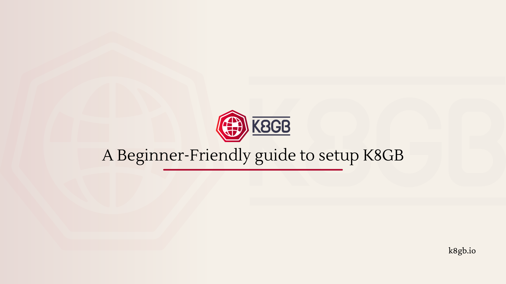

---
date:
  created: 2026-03-22
authors:
  - itsfarhan
categories:
  - Tutorial
tags:
  - k8gb
  - kubernetes
  - setup
  - beginners
---



# A Beginner-Friendly Guide to k8gb Local Setup

When I first started working with k8gb, the local setup took me a while to fully wrap my head around. And I'm a contributor to this project! So if you're new to k8gb and the local setup feels like a lot to take in, trust me — that's completely normal.

The local setup simulates a real multi-cluster, multi-region environment on your laptop. That's genuinely powerful, but it also means there's more moving parts than a typical "run one cluster" tutorial. Once the mental model clicks, everything falls into place.

So I decided to write the walkthrough I wish I had when I was getting started.

<!-- more -->

## Why Does the Local Setup Feel Like a Lot?

Before we get into the actual setup, let me explain what's actually happening. This context makes everything else much easier to follow.

When you run k8gb locally, you're not just spinning up one Kubernetes cluster. You're spinning up **three separate clusters**:

- `test-gslb1` — your first Kubernetes cluster (tagged as `eu` region)
- `test-gslb2` — your second Kubernetes cluster (tagged as `us` region)
- `edgedns` — a special cluster that runs a DNS server (BIND) acting as your "global" DNS

This is what makes k8gb feel complex at first. You're simulating a real-world multi-region setup on your laptop. Once that clicks, everything else starts to make sense.

Here's the mental model:

```
Your Laptop
├── cluster: test-gslb1 (eu region) → runs k8gb + your app
├── cluster: test-gslb2 (us region) → runs k8gb + your app
└── cluster: edgedns → runs BIND DNS server (the "global" DNS)
```

k8gb on each cluster talks to the edgedns cluster to register which cluster is healthy. When a client asks "where is `roundrobin.cloud.example.com`?", the DNS server returns IPs from healthy clusters only.

That's the whole idea. Now let's set it up.

## What You Actually Need (And Why)

The setup requires a few tools. Here's what each one is for so you know what you're installing:

| Tool | Why You Need It |
|------|----------------|
| **Docker** | k3d creates Kubernetes clusters inside Docker containers |
| **k3d** | The tool that creates and manages your local k3s clusters |
| **kubectl** | To interact with your clusters (check pods, apply configs, etc.) |
| **helm** | To install k8gb and test apps onto the clusters |
| **Go** | Only needed if you want to run the integration tests (terratest) |
| **golangci-lint** | Only needed if you're contributing code, not just running the demo |
| **Git** | To clone the repo |

For just running the local demo, you really only need **Docker, k3d, kubectl, and helm**. Go and golangci-lint are for development work.

> ⚠️ **Important**: Docker needs at least **8GB of memory** allocated. Three clusters running simultaneously is memory-heavy. Check your Docker Desktop settings and bump it up if needed.

## Installing the Prerequisites

If you're on macOS, the easiest way:

```sh
# Install k3d
brew install k3d

# Install kubectl
brew install kubectl

# Install helm
brew install helm
```

On Linux:

```sh
# Install k3d
curl -s https://raw.githubusercontent.com/k3d-io/k3d/main/install.sh | bash

# Install kubectl
curl -LO "https://dl.k8s.io/release/$(curl -L -s https://dl.k8s.io/release/stable.txt)/bin/linux/amd64/kubectl"
chmod +x kubectl && sudo mv kubectl /usr/local/bin/

# Install helm
curl https://raw.githubusercontent.com/helm/helm/main/scripts/get-helm-3 | bash
```

Verify everything is installed:

```sh
docker --version
k3d version
kubectl version --client
helm version
```

## Cloning the Repo

```sh
git clone https://github.com/k8gb-io/k8gb.git
cd k8gb
```

## Running the Setup

Now the magic command:

```sh
make deploy-full-local-setup
```

This single command does a lot. Here's what's actually happening under the hood:

1. Creates 3 k3d clusters (test-gslb1, test-gslb2, edgedns)
2. Installs BIND DNS server on the edgedns cluster
3. Installs k8gb on both test clusters using Helm
4. Deploys a test app called [podinfo](https://github.com/stefanprodan/podinfo) on both clusters
5. Creates GSLB resources (round-robin and failover) on both clusters
6. Configures DNS delegation so edgedns knows about both clusters

This takes a few minutes. Grab a coffee. ☕

When it's done, you'll see output confirming everything is up.

## Verifying the Setup

First, check that all three clusters are running:

```sh
kubectl cluster-info --context k3d-edgedns && \
kubectl cluster-info --context k3d-test-gslb1 && \
kubectl cluster-info --context k3d-test-gslb2
```

You should see connection info for all three. If any of them fail, something went wrong during setup.

Now let's verify that DNS is actually working. This is the key test:

```sh
dig @localhost -p 1053 roundrobin.cloud.example.com +short +tcp
```

Breaking down this command:
- `dig` — a DNS lookup tool
- `@localhost -p 1053` — ask the edgedns cluster's DNS server (running on port 1053 locally)
- `roundrobin.cloud.example.com` — the hostname k8gb is managing
- `+short` — show just the IP addresses
- `+tcp` — use TCP instead of UDP

You should see **4 IP addresses** — 2 from each cluster:

```
172.20.0.2
172.20.0.5
172.20.0.4
172.20.0.6
```

If you see 4 IPs, k8gb is working. Both clusters are healthy and their IPs are being returned in the DNS response.

You can also verify the IPs match the actual cluster nodes:

```sh
for c in k3d-test-gslb{1,2}; do
  kubectl get no \
    -ocustom-columns="NAME:.metadata.name,IP:status.addresses[0].address" \
    --context $c
done
```

## 🎮 Trying the Round Robin Demo

Both clusters have podinfo installed. Each cluster is tagged with a region — one returns `eu`, the other returns `us` in its response. This makes it easy to see which cluster is serving your request.

Run this a few times:

```sh
make test-round-robin
```

You should see the `message` field alternating between `eu` and `us`:

```json
{
  "hostname": "frontend-podinfo-856bb46677-8p45m",
  "message": "eu"
}
```

```json
{
  "hostname": "frontend-podinfo-856bb46677-8p45m",
  "message": "us"
}
```

That's round-robin load balancing working across two clusters. Each DNS response picks a different cluster's IP.

## Trying the Failover Demo

Failover is where k8gb really shines. Let's see it in action.

First, switch to failover mode:

```sh
make init-failover
```

Now test it — you should only see `eu` responding (it's the primary):

```sh
make test-failover
```

Now simulate a failure by stopping the app on the primary cluster:

```sh
make stop-test-app
```

Wait about 30 seconds (that's the DNS TTL), then test again:

```sh
make test-failover
```

Now you should see only `us` responding! k8gb detected that the primary cluster's pods are unhealthy and automatically removed it from DNS. Traffic failed over to the secondary cluster.

```json
{
  "hostname": "frontend-podinfo-856bb46677-v5nll",
  "message": "us"
}
```

Bring the primary back:

```sh
make start-test-app
```

After another ~30 seconds, `eu` will be back in the DNS rotation.

> 💡 **Why 30 seconds?** That's the DNS TTL (Time To Live). DNS records are cached for 30 seconds, so changes take up to 30 seconds to propagate. This is configurable in the GSLB resource via `dnsTtlSeconds`.

## Cleaning Up

When you're done experimenting:

```sh
make destroy-full-local-setup
```

This removes all three clusters and cleans everything up.

## 💡 Key Things I Learned

- **Three clusters, not one** — always remember you're running a full multi-cluster simulation locally
- **edgedns is the brain** — it's the DNS server that knows about all clusters and their health
- **DNS TTL matters** — changes don't happen instantly, there's always a propagation delay
- **Ports to remember**: edgedns answers on `:1053`, test-gslb1 CoreDNS on `:5053`, test-gslb2 on `:5054`
- **The Makefile is your friend** — run `make help` to see all available targets

## Things That Took Me a Moment to Understand!!!!

The biggest thing for me was building the mental model first — understanding that you're running three clusters, not one. Once that clicked, the rest of the setup made a lot more sense.

The DNS verification step also took a moment. Commands like `dig @localhost -p 1053` look intimidating if you haven't used `dig` before. But it's just asking "hey DNS server, what's the IP for this hostname?" — once you see it that way, it's straightforward.

The 30-second wait during the failover demo also caught me off guard the first time. I stopped the app, immediately tested, and got confused when `eu` was still responding. DNS caching is real!

## What's Next?

Now that you have k8gb running locally, here's what I'd suggest exploring next:

- Look at the actual GSLB resource files in `deploy/gslb/` to understand the configuration
- Try the [Kuar app demo](../local-kuar.md) for a visual way to see DNS resolution in action
- Read about the different [load balancing strategies](../strategy.md) — round-robin, failover, weighted, and GeoIP
- Check out the [metrics](../metrics.md) docs and run `make deploy-prometheus` to see k8gb's Prometheus metrics

The local setup is the best way to understand how k8gb works before deploying it to a real cluster. Play around with it, break things, and see how k8gb responds!

---

If you have questions or get stuck, join us on [#k8gb on CNCF Slack](https://cloud-native.slack.com/archives/C021P656HGB). The community is friendly and happy to help.

Happy load balancing! 🚀
