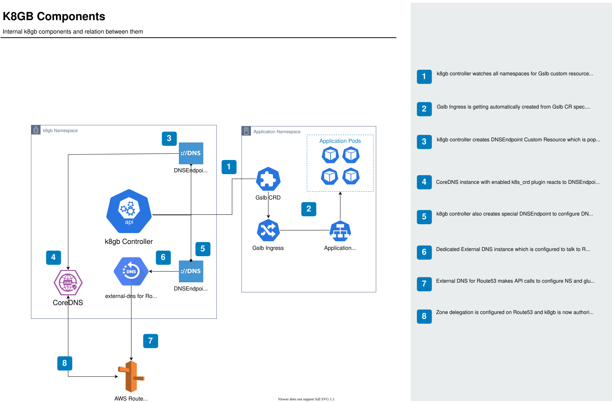
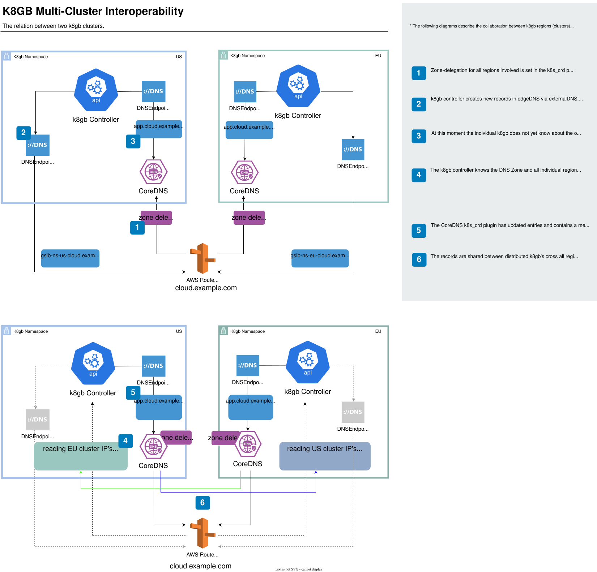

# K8GB Internal Components

k8gb is a Kubernetes operator that reconciles `Gslb` (and related) resources, updates DNS via ExternalDNS / provider integrations, and serves authoritative answers through an embedded CoreDNS instance. The diagrams below show the main control-plane and multi-cluster data flows.

*Internal component flow, including a Route53 integration scenario: the operator watches application ingress objects, maintains DNSEndpoint / zone delegation state, and CoreDNS serves the delegated zone.*

*Multi-cluster interoperability: paired k8gb instances exchange health via DNS and publish a consistent global view to clients.*
