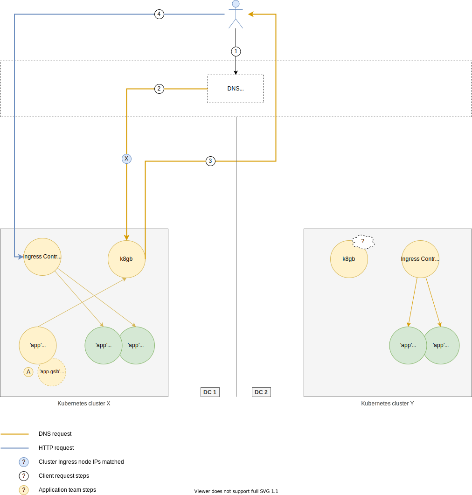

# Oh My GLB

A Global Service Load Balancing solution with a focus on having cloud native qualities and work natively in a Kubernetes context.

## Motivation

The ability to load balance HTTP requests across multiple Kubernetes clusters, running in multiple data centers/clouds is a key requirement for a resilient system. At the time of writing there does not seem to be an existing OSS solution that will provide this capability in a cloud native, Kubernetes friendly way.

### Service health

TODO - specific to the health of Pod Endpoints...

## Goals

The goal of this project is to provide an implementation of a cloud native GSLB that meets the following requirements:

* Is lightweight in terms of resource requirements and runtime complexity
* Runs well in a Kubernetes cluster
* To achieve high availability/redundancy we should be able to run multiple instances (potentially across multiple data centers or clouds) with shared state
* Use other proven, supported ([CNCF](https://www.cncf.io/projects/) projects as an example) and popular open source projects where applicable. Don't reinvent the wheel where not necessary
* Allow end users to define their GSLB configuration via Kubernetes native means (resource annotations, CRD's etc.)
* Provide observability as to the operational health of the solution

## Use cases

The following outlines some common use cases and what this solution should solve for.

### Basic

At it's simplest, an HTTP request should be handled by a healthy service. This service might reside in multiple Kubernetes clusters, all of which might be in geographically disparate locations, including a/any cloud provider/s.



In the use case above, the following resources are configured by the application team:

A: A Kubernetes `Glsb` CRD (Custom Resource Definition) is created which indicates to Oh My GLB that it should create the necessary GSLB configuration.

A potential example of what this `Glsb` resource would look like:

```yaml
apiVersion: ohmyglb.absa.oss/v1beta1
kind: Glsb
metadata:
  name: app
spec:
  host: app.cloud.absa.internal # This is the GLSB enabled host that clients would use
  http: # This section mirrors the same structure as that of an Ingress resource and will be used verbatim when creating the corresponding Ingress resource that will match the GLSB host
    paths:
    - backend:
        serviceName: app
        servicePort: http
      path: /
  strategy:
    roundRobin: # Use a round robin load balancing strategy, when deciding which downstream clusters to route clients too
      weight: 80 # 80% of requests will be routed to the cluster where this resource is created
  tls:
    secretName: app-glsb-tls # Use this Secret to add to the TLS configuration for the new Ingress resource that will be created for the GLSB host
```

On creating this `Glsb` resource the Oh My GLB controller will:

* Create a new `Ingress` resource that will allow requests with the GSLB host (`app.cloud.absa.internal`) to be handled by the cluster's Ingress controller
* Configure a health check strategy on the underlying `app` Pods. The Pods here are the Pods matched by the Service configured by `serviceName`
* Based on the health of those Pods, if at least one of the Pods is healthy, add DNS records with the external addresses of the cluster's nodes running the Ingress controllers

#### Client

The client flow can now be described as:

1: Client makes a request to https://app.cloud.absa.internal

2: In resolving the IP for `app.cloud.absa.internal`, the Recursive Resolver forwards the requests to one of the instances of Oh My GLB. The green circles indicate healthy instances of Oh My GLB in the diagram above.

3: Based on:

* the availability of the service (are there any healthy Pods)
* the weighting applied to each cluster

one of the cluster Ingress node IP's is returned to the client. E.g. `10.0.100.20`

4: The client, using the resolved IP of `10.0.100.20` now makes a connection and proceeds with the request. The request will be handled by one of the cluster's Ingress controllers and via the created GLSB Ingress resource, the request is proxied through to one of the available Pods