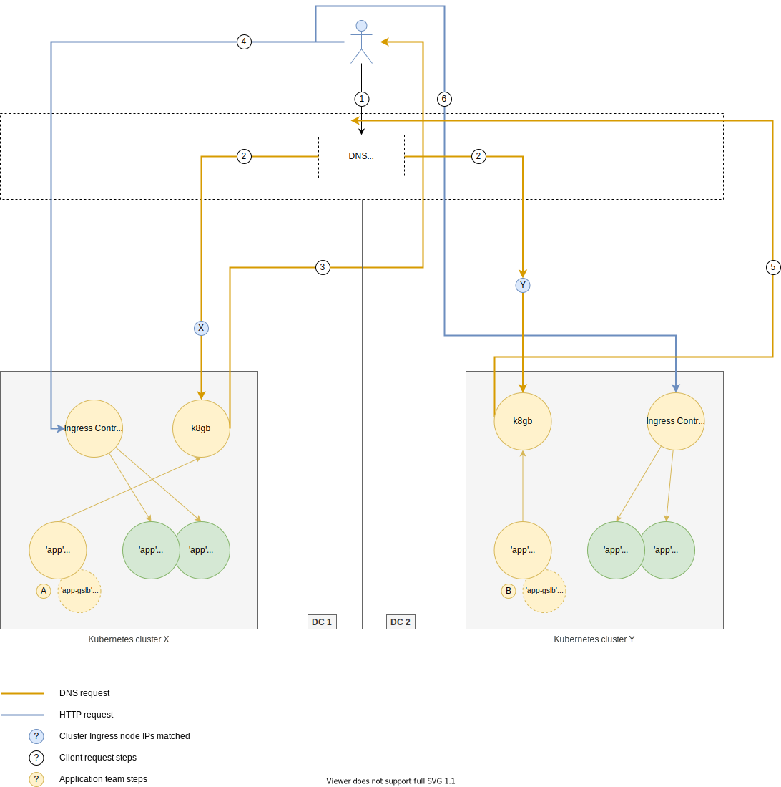
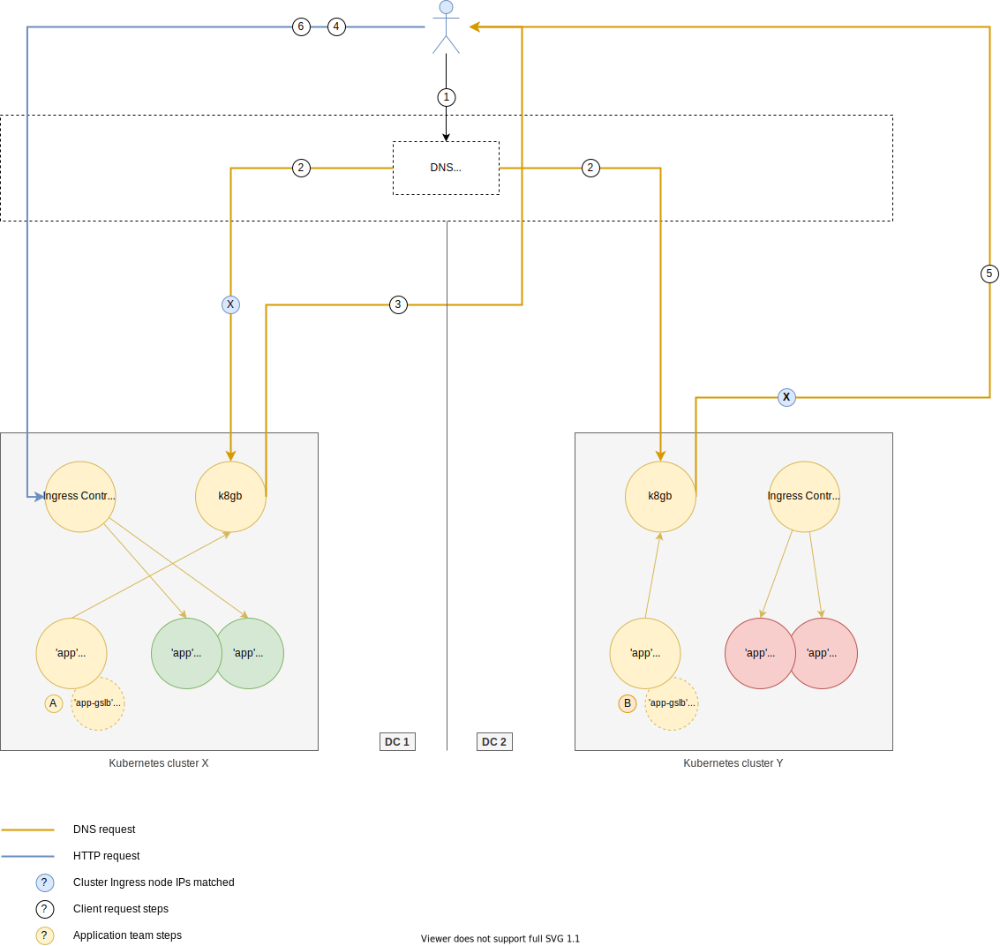

# Oh My GLB

A Global Server Load Balancing solution with a focus on having cloud native qualities and work natively in a Kubernetes context. The term GSLB, as used in this context, obeys the same principles as defined in the following sources:

* [What Is GSLB? Load Balancing Explained - Cloudflare](https://www.cloudflare.com/learning/cdn/glossary/global-server-load-balancing-gslb/)
* [Global Server Load Balancing Definition - AVI Networks](https://avinetworks.com/glossary/global-server-load-balancing-2/)

In short, the ability to direct HTTP requests to a local load balancer (Kubernetes Ingress controller instances) based on the health of services (Pods) in multiple, potentially geographically dispersed, Kubernetes clusters whether on premises or in cloud. With additional options around what criteria to use (round robin, weighting, active/passive, etc.) when determining the best local load balancer/ingress instance to resolve.

## Motivation

The ability to load balance HTTP requests across multiple Kubernetes clusters, running in multiple data centers/clouds is a key requirement for a resilient system. At the time of writing there does not seem to be an existing OSS GSLB (Global Server Load Balancer) solution that will support this requirement in a cloud native, Kubernetes friendly way.

### Service health

One important aspect of this solution is that the GSLB load balancing should be based on the availability of Kubernetes Pods that a GSLB enabled host represents. I.e. Pod health, as determined by the configured [liveness probes](https://kubernetes.io/docs/tasks/configure-pod-container/configure-liveness-readiness-startup-probes/) and [readiness probes](https://kubernetes.io/docs/tasks/configure-pod-container/configure-liveness-readiness-startup-probes/#define-readiness-probes) of a Pod should determine which resulting IP of the downstream Ingress will be resolved.

This is in contrast to most existing OSS GSLB solutions which focus on traditional ICMP, TCP and HTTP health checks.

## Goals

The goal of this project is to provide an implementation of a cloud native GSLB that meets the following requirements:

* Is lightweight in terms of resource requirements and runtime complexity
* Runs well in a Kubernetes cluster
* To achieve high availability/redundancy we should be able to run multiple instances (potentially across multiple data centers or clouds) with shared state
* Use other proven, supported ([CNCF](https://www.cncf.io/projects/) projects as an example) and popular open source projects where applicable. Don't reinvent the wheel where not necessary
* Allow end users to define their GSLB configuration via Kubernetes native means (resource annotations, CRD's etc.)
* Provide observability into the operational health of the solution

## Use cases

The following outlines some common use cases and what this solution should solve for.

### 1. Basic - Single cluster

At it's simplest, an HTTP request should be handled by a healthy service. This service might reside in multiple Kubernetes clusters, all of which might be in geographically disparate locations, including a/any cloud provider/s.


#### 1.1 Application team

In the use case above, the following resources are configured by the _application_ team:

**A.** The Kubernetes `Gslb` CRD (Custom Resource Definition) is created which indicates to an Oh My GLB controller that it should create the necessary GSLB configuration for the cluster where the the `Gslb` resource is created and the Oh My GLB controller for that cluster.

A potential example of what this `Gslb` resource would look like:

```yaml
apiVersion: ohmyglb.absa.oss/v1beta1
kind: Gslb
metadata:
  name: app
spec:
  host: app.cloud.absa.internal # This is the GSLB enabled host that clients would use
  http: # This section mirrors the same structure as that of an Ingress resource and will be used verbatim when creating the corresponding Ingress resource that will match the GSLB host
    paths:
    - backend:
        serviceName: app
        servicePort: http
      path: /
  strategy: roundRobin # Use a round robin load balancing strategy, when deciding which downstream clusters to route clients too
  tls:
    secretName: app-glsb-tls # Use this Secret to add to the TLS configuration for the new Ingress resource that will be created for the GSLB host
```

On creating this `Gslb` resource, the Oh My GLB controller watching the cluster where this resource is created, will:

1. Create a new `Ingress` resource that will allow requests with the GSLB host (`app.cloud.absa.internal`) to be handled by the cluster's Ingress controller
2. Configure a health check strategy on the underlying `app` Pods. The Pods here are the Pods matched by the Service configured by `serviceName`
3. Based on the health (see [Service health](#service-health)) of those Pods, if at least one of the Pods is healthy, add DNS records with the external addresses of the cluster's nodes running the Ingress controllers

#### 1.2 Client

In the use case above, the following would describe a client request:

1. Client makes a request to <https://app.cloud.absa.internal>
2. In resolving the IP for `app.cloud.absa.internal`, the Recursive Resolver forwards the requests to one of the instances of Oh My GLB
3. One of the cluster Ingress node IPs is returned to the client. E.g. `10.0.100.20`
4. The client, using the resolved IP of `10.0.100.20` now makes a connection and proceeds with the request. The request will be handled by one of the cluster's Ingress controllers and via the created GSLB Ingress resource, the request is proxied through to one of the available Pods as per the usual Kubernetes Ingress mechanics

#### 1.3 Outcome

In this use case, only _Kubernetes cluster X_ would be eligible to handle ingress traffic for `https://app.cloud.absa.internal` as there was no `Gslb` resource created in _Kubernetes cluster Y_.

### 2. Basic - Multi cluster

In this use case, we create a second `Gslb` resource in _Kubernetes cluster Y_ making both cluster **X** and **Y** eligible to handle ingress traffic. However, this use case should apply to any amount of clusters as well.



#### 2.1 Application team

In this use case the same steps for [Application team](#11-application-team) are executed but on _Kubernetes cluster Y_. This means that the Oh My GLB instance for cluster **Y** (assuming healthy Pods) will have added the Ingress node's external IP addresses.

This means that from an overall Oh My GLB perspective, there are now external IPs for *both* clusters, **X** and **Y**. This implies that all Oh My GLB instances **share common state** and contain IPs for all eligible ingress nodes across *all* clusters. This enables any instance of Oh My GLB to handle resolution for `Gslb` resource `hosts`'s.

#### 2.2 Client

Once again, the client request is handled much the same as the first use case, except for the fact that the cluster ingress IP resolved will use a round robin strategy (the default strategy) between clusters **X** and **Y**.

1. Same as basic use case
2. Same as basic use case
3. One of the cluster Ingress node IPs from cluster **X** is returned to the client. E.g. `10.0.100.20`
4. The client, using the resolved IP of `10.0.100.20` now makes a connection and proceeds with the request
5. On the next request, one of the cluster Ingress node IPs from cluster **Y** is returned to the client. E.g. `10.0.200.40`
6. The client, using the resolved IP of `10.0.200.40` now makes a connection and proceeds with the request

#### 2.3 Outcome

This use case demonstrates that clusters with healthy Pods should have their Ingress node IPs eligible for resolution, across *all* clusters configured with a `Gslb` resource with the same **`spec.name`**.

> The load balancing strategy should be configurable, see [Load balancing strategies](#load-balancing-strategies)

### 3. Unhealthy service - Multi cluster

This use case demonstrates what should happen if the Pods in a cluster (in this use case, cluster **Y**) are not available or unhealthy.



#### 3.1 Application team

Same as the [multi cluster use case](#2-basic---multi-cluster).

#### 3.2 Client

1. Same as basic use case
2. Same as basic use case
3. Based on criteria, cluster Ingress node IPs from cluster **X** are returned (`10.0.100.20`), given that there are no healthy Pods in cluster **Y** and therefore those cluster Ingress node IPs for cluster **Y** have been **removed**
4. The client, using the resolved IP of `10.0.100.20` now makes a connection and proceeds with the request
5. On the next request, another one of the cluster Ingress node's IPs from cluster **X** is returned to the client. E.g. `10.0.100.21`
6. The client, using the resolved IP of `10.0.100.21` now makes a connection and proceeds with the request

#### 3.3 Outcome

This use case demonstrates that clusters with no healthy Pods should *not* have their Ingress node IPs eligible for resolution. Meaning that no ingress traffic should ever be sent to clusters where the application is not in a state to accept requests.

If the Pods in cluster **Y** were to once again become healthy (liveness and readiness probes start passing) then the Ingress node IPs for cluster **Y** would once again be added to the eligible pool of Ingress node IPs.

## Load balancing strategies

The following load balancing strategies, as it relates to resolving Ingress node IPs, should be provided as part of the initial implementation:

* **Round robin** - The default strategy
* **Weighted round robin** - Specialisation of the above strategy but where a percentage weighting is applied to determine which cluster's Ingress node IPs to resolve. E.g. 80% cluster **X** and 20% cluster **Y**
* **Failover** - Pinned to a specified primary cluster until that cluster has no available Pods, upon which the next available cluster's Ingress node IPs will be resolved. When Pods are again available on the primary cluster, the primary cluster will once again be the only eligible cluster for which cluster Ingress node IPs will be resolved
* **Manual** - Eligibility is manually specified as to which cluster(s) are eligible. If there are no available Pods in the specified clusters, then no cluster Ingress node IPs will be resolved and the client will get a [`NXDOMAIN`](https://www.dnsknowledge.com/whatis/nxdomain-non-existent-domain-2/) response

The above strategies are specified as part of the `Gslb` resource(s) `spec`.

## Configuration

`Gslb` resources should contain all configuration options for the GSLB hosts they represent.
However, any other global Oh My GLB specific configuration should be specified as arguments to the binary or by reading a specified YAML configuration file.

## Runtime environments

Oh My GLB instances should be able to run on any Linux based operating system but should run best within in a Kubernetes environment as a Deployment etc.

## Existing GSLB projects

The following projects represent examples of other GSLB implementations that could be leveraged or used as reference. However, it is important that the implementation of this project adhere to the [goals](#goals) outlined and which may not align with the implementation of these projects.

### Open source

* Polaris - <https://github.com/polaris-gslb/polaris-gslb>
* PowerGSLB - <https://github.com/AlekseyChudov/powergslb>
* <https://github.com/datianshi/opensource-gslb>

### Commercial

* AVI Networks - <https://avinetworks.com/glossary/global-server-load-balancing-2/>
* F5 Networks - <https://www.f5.com/products/global-server-load-balancing-gslb>
  * See <https://blog.openshift.com/deploying-openshift-applications-multiple-datacenters/> (Networking section)
* Infoblox DTC - <https://www.infoblox.com/products/dns-traffic-control/>
