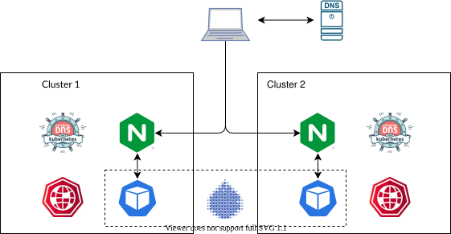

# Integration with Liqo

You can provide powerful global multi-cluster capabilities by combining k8gb and [liqo.io](https://docs.liqo.io).

In this tutorial, you will learn how to leverage Liqo and K8GB to deploy and expose a multi-cluster application through a *global ingress*.
More in detail, this enables improved load balancing and distribution of the external traffic towards the application replicated across multiple clusters.

Liqo will globally schedule workloads and provide east-west connectivity, while K8GB will globally balance user traffic providing north-south connectivity over the multi-cluster and/or multi-provider environment.

The figure below outlines the high-level scenario, with a client consuming an application from either cluster 1 (e.g., located in EU) or cluster 2 (e.g., located in the US), based on the endpoint returned by the DNS server.



## Setup Environment

Use Liqo **1.x** with current [liqoctl](https://docs.liqo.io/en/latest/installation/liqoctl.html).

Checkout the Liqo [global-ingress example](https://github.com/liqotech/liqo/tree/master/examples/global-ingress)
(`examples/global-ingress/setup.sh` in the Liqo repository) for the environment setup script and more details.
It creates the k3d clusters required for the K8GB playground as described in [Local playground for testing and development](local.md) and installs Liqo over them.

After the script finishes, export kubeconfigs (names match the Liqo example clusters):

```bash
export KUBECONFIG_DNS=$(k3d kubeconfig write edgedns)
export KUBECONFIG=$(k3d kubeconfig write gslb-eu)
export KUBECONFIG_US=$(k3d kubeconfig write gslb-us)
```

## Peer the clusters

Liqo 1.x peers clusters with a single `liqoctl peer` invocation (the old `liqoctl generate peer-command` flow was removed).
See [Peer two Clusters](https://docs.liqo.io/en/latest/usage/peer.html).

From the *gslb-eu* consumer cluster, peer to *gslb-us*. The example environments typically expose the Liqo gateway with a `NodePort` service:

```bash
liqoctl peer --remote-kubeconfig "$KUBECONFIG_US" --gw-server-service-type NodePort
```

When the command returns successfully, check the peering status:

```bash
kubectl get foreignclusters
kubectl get node --selector=liqo.io/type=virtual-node
```

## Deploy an application

First, create a hosting namespace in the *gslb-eu* cluster, and offload it to the remote cluster through Liqo
([namespace offloading](https://docs.liqo.io/en/latest/usage/namespace-offloading.html)):

```bash
kubectl create namespace podinfo
liqoctl offload namespace podinfo --namespace-mapping-strategy EnforceSameName
```

At this point, it is possible to deploy the *podinfo* helm chart in the `podinfo` namespace:

```bash
helm upgrade --install podinfo --namespace podinfo podinfo/podinfo \
    -f https://raw.githubusercontent.com/liqotech/liqo/master/examples/global-ingress/manifests/values/podinfo.yaml
```

This chart creates a *Deployment* with a *custom affinity* to ensure that the two frontend replicas are scheduled on different nodes and clusters:

```yaml
affinity:
  nodeAffinity:
    requiredDuringSchedulingIgnoredDuringExecution:
      nodeSelectorTerms:
      - matchExpressions:
        - key: node-role.kubernetes.io/control-plane
          operator: DoesNotExist
  podAntiAffinity:
    requiredDuringSchedulingIgnoredDuringExecution:
    - labelSelector:
        matchExpressions:
        - key: app.kubernetes.io/name
          operator: In
          values:
          - podinfo
      topologyKey: "kubernetes.io/hostname"
```

Additionally, it creates a *Gslb* resource configured to distribute the traffic across the different clusters.
The application is an HTTP service, you can contact it using the *curl* command.
Use the `-v` option to understand which of the nodes is being targeted.

You need to use the DNS server in order to resolve the hostname to the IP address of the service.
To this end, create a pod in one of the clusters (it does not matter which one) overriding its DNS configuration.

```bash
HOSTNAME="liqo.cloud.example.com"
K8GB_COREDNS_IP=$(kubectl get svc k8gb-coredns -n k8gb -o custom-columns='IP:spec.clusterIP' --no-headers)

kubectl run -it --rm curl --restart=Never --image=curlimages/curl:8.21.0 --command \
    --overrides "{\"spec\":{\"dnsConfig\":{\"nameservers\":[\"${K8GB_COREDNS_IP}\"]},\"dnsPolicy\":\"None\"}}" \
    -- curl "$HOSTNAME" -v
```
