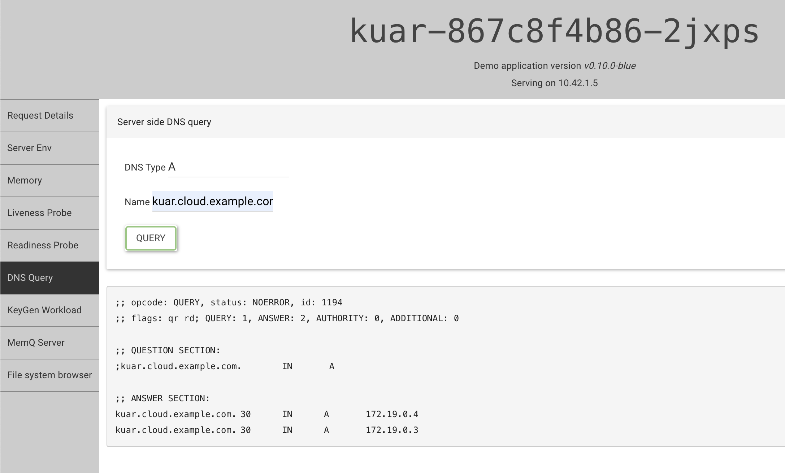
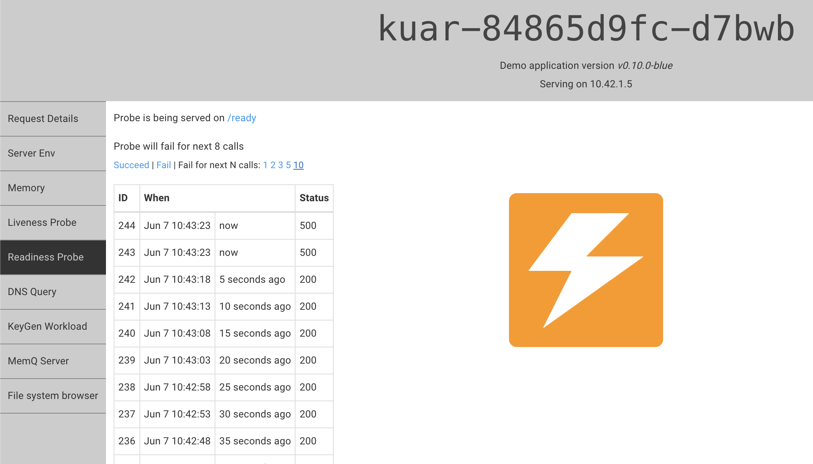
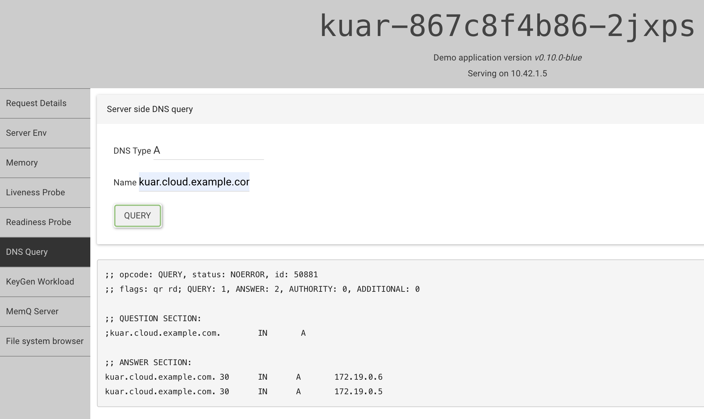

# Local playground with Kuar web app

Kuar is a web based (SPA) application that contains a couple of handy features that can verify the k8gb functionality. It can resolve DNS names, simulate probe failures, can simulate a CPU-intensive workload by generating RSA key pairs, and also contains a simple API for the queue (push & pop strings).

Make sure you have all the tools mentioned in [this section](./local.md#environment-prerequisites) installed.

First, spin up two local k3s clusters:

```sh
make deploy-full-local-setup
```

Again, you can verify that everything is up and running by following [the steps here](./local.md#verify-installation).

## Deploy the Kuar app

```sh
make deploy-kuar-app
```

This task will deploy Kuar into both clusters and exposes it. It also patches the installed nginx controller to serve the app even if the `Host` header is not provided in the request. This way you can access the application in your browser under http://localhost:80 for cluster 1 and http://localhost:81 for cluster 2.

Make sure the app on http://localhost is responding, it may take a minute for the nginx ingress controller to restart with the correct parameters.

The make target also modified the deployment of the Kuar application to use our core DNS servers. To verify that this was done, one can open the Kuar's file system browser tab and [open](http://localhost/fs/etc/resolv.conf) `/etc/resolv.conv`. It should contain the same IP as cluster-IP assigned to `k8gb-coredns` service.

Together with Kuar, we also prepared the failover gslb resource for k8gb. Where the first cluster (geotag = `eu`) is the primary one.

## Simulate failure

Before we do that, we can visit Kuar on [cluster 2](http://localhost:81) and verify that hostname `kuar.cloud.example.com` is correctly resolved IPs corresponding to nodes in the primary cluster - which is the cluster 1. This DNS resolution will work the same way on both clusters, but we will be simulating the failure on cluster 1 soon so the web API will not respond on cluster 1.



Now we can open a new tab with Kuar on cluster one and simulate the readiness probe failure for the next 10 checks - http://localhost/-/readiness.



Once we do that, the web API on cluster 1 will become unavailable. So we can switch to cluster 2 and run the web-based dig again. This time it should respond with IPs from cluster two. However, once the readiness probe will start succeeding again, it will switch back to cluster 1.

