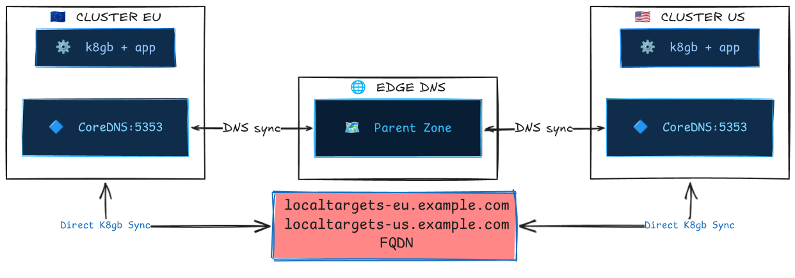

# Split-Brain Scenarios and System Behavior

## Overview

k8gb operates as a **decentralized, peer-to-peer** global load balancer. There is no central control plane — each k8gb instance runs independently in its own cluster and discovers the state of other clusters via **DNS queries** to the edge (parent) DNS server. This architecture eliminates single points of failure but introduces the possibility of **split-brain scenarios** when network connectivity between clusters, or to the shared edge DNS, is disrupted.

This document describes the mechanisms k8gb uses to handle network partitions and the resulting system behavior for each load-balancing strategy.

!!! note "Why this matters"
    k8gb is often the linchpin of a disaster recovery strategy. Understanding its behavior during degraded network conditions is essential for operators who need to reason about worst-case scenarios and set correct expectations with stakeholders.

## How Clusters Discover Each Other

Before understanding split-brain behavior, it's important to understand the normal communication path between k8gb instances:



1. Each k8gb instance publishes its local healthy IPs as `localtargets-<host>` A records on its local CoreDNS.
2. Each instance publishes NS delegation records and glue A records to the edge DNS via ExternalDNS (or Infoblox).
3. During reconciliation (every `reconcileRequeueSeconds`, default 30s), each instance queries the **edge DNS** to discover NS records for other clusters, resolves glue A records, and then queries each remote cluster's CoreDNS for that cluster's `localtargets-<host>` records.
4. The combined set of healthy local + discovered remote IPs forms the **final DNS response** served to clients.

**Key insight**: Cluster-to-cluster communication is **indirect** through DNS. Clusters never talk to each other's Kubernetes APIs. The only shared state is the DNS zone on the edge DNS server.

## What Constitutes a Split-Brain

A split-brain occurs when k8gb instances in different clusters have **divergent views** of the global state. This can happen when:

| Failure Mode | Description |
|---|---|
| **Edge DNS unreachable from one cluster** | One cluster cannot query the edge DNS and thus cannot discover remote clusters' NS records. |
| **Inter-cluster DNS unreachable** | The edge DNS is reachable, but one cluster cannot reach another cluster's CoreDNS to resolve `localtargets-*` records. |
| **Edge DNS unreachable from all clusters** | No cluster can read or update the shared DNS state. Each cluster degrades to locally resolvable targets on reconciliation; stale answers may still persist in downstream DNS caches until TTL expiry.|
| **Edge DNS writable but not readable** | One cluster can push updates (ExternalDNS sync) but can't read answers — or vice versa. |

## Behavior Per Strategy

### Round Robin

| Condition | System Behavior |
|---|---|
| **Normal** | All clusters' healthy IPs are merged and returned to clients. |
| **Cluster EU cannot reach edge DNS** | EU returns **only its own local IPs**. US (if edge DNS is reachable) continues to return both EU + US IPs. _Asymmetric resolution._ |
| **Cluster US pods unhealthy** | EU discovers that `localtargets-<host>` returns empty for US → only EU IPs are served globally. Self-healing. |
| **Edge DNS down for all** | Each cluster returns **only its own local IPs**. Clients hitting either cluster's CoreDNS get valid responses, but there is no cross-cluster balancing. Traffic is effectively pinned to whichever cluster the client's recursive resolver reaches. |

!!! warning "Stale data window"
    If the edge DNS becomes unreachable, k8gb will omit remote targets on the next reconciliation and write a reduced `DNSEndpoint`. Stale answers can still persist in recursive resolvers and client caches until their TTLs expire, so the observable stale-data window is driven by reconciliation timing plus downstream DNS caching.

### Failover

Failover has the most nuanced split-brain behavior because it introduces the concept of **primary** and **secondary** clusters.

| Condition | Primary Cluster Behavior | Secondary Cluster Behavior |
|---|---|---|
| **Normal, primary healthy** | Returns own IPs. | Discovers primary is healthy via DNS → returns primary's IPs. |
| **Normal, primary unhealthy** | Discovers it is unhealthy → returns all discovered external (secondary) IPs. | Discovers primary's `localtargets-*` is empty → returns its own IPs. |
| **Primary cannot reach edge DNS, primary healthy** | Returns own IPs (correct). | Cannot discover primary's `localtargets-*` → treats primary as unreachable → returns **own IPs** (premature failover). |
| **Primary cannot reach edge DNS, primary unhealthy** | Cannot discover secondaries → returns **empty targets** (outage for clients resolved by this cluster's CoreDNS). | Cannot discover primary → returns own IPs (correct failover). |
| **Secondary cannot reach edge DNS** | Unaffected. Returns own IPs as primary. | Cannot discover primary → returns **own IPs** (premature failover). Clients resolved by this cluster receive secondary IPs when they should receive primary IPs. |
| **Edge DNS down for all** | Returns own IPs if healthy, empty if unhealthy. | Returns own IPs (premature failover). Both clusters serve traffic independently. |

!!! danger "Critical: Premature failover"
    The most impactful split-brain scenario for failover is when the **secondary cluster loses connectivity to the edge DNS** while the primary is still healthy. The secondary will start serving its own IPs, effectively splitting traffic between primary and secondary. This is a **false failover**.

    **Mitigation**: Treat `k8gb_gslb_errors_total` as a coarse signal that reconciliations are failing, not as a DNS-specific indicator. For DNS-related diagnosis, monitor controller logs for messages such as `can't lookup GlueA record` and `can't resolve FQDN using nameservers`, and verify DNS reachability from the affected cluster to the edge DNS and remote CoreDNS servers.

### Weighted Round Robin (WRR)

WRR behaves identically to Round Robin during split-brain, with one additional nuance: when a cluster is partitioned and can only see its own targets, the **weight labels are still published** but apply to a reduced target set. The effective traffic distribution will not match the configured weights until connectivity is restored.

### GeoIP

GeoIP behaves similarly to Round Robin during split-brain. When a cluster is partitioned:

- It will return only its own IPs regardless of the client's geographic location.
- Clients that should be directed to a closer (but unreachable-from-this-cluster) cluster will instead be served by the local cluster.
- This is a **degraded but functional** state — availability is preserved at the cost of latency optimization.

## The Reconciliation Loop and Convergence

When a partition **heals**, convergence usually happens in two stages:

1. **Within 1 reconciliation cycle** (`reconcileRequeueSeconds`, default 30s): the k8gb controller re-discovers remote targets and rewrites the `DNSEndpoint`.
2. **After DNS caches expire** (`dnsTtlSeconds` for the GSLB record, plus any resolver or client-side caching): clients begin receiving the refreshed answers consistently.

`nsRecordTTL` matters when delegation records themselves change, but it is not usually the limiting factor for recovery from a transient partition where the existing NS and glue records remain valid.

**Practical convergence estimate**: about `reconcileRequeueSeconds + dnsTtlSeconds + client_cache_ttl`.

## Observable Symptoms

| Symptom | Likely Cause | Where to Look |
|---|---|---|
| `k8gb_gslb_errors_total` increasing | Reconciliation failures are increasing; DNS resolution problems are one possible cause, but not the only one | Prometheus / metrics endpoint, controller logs |
| `localtargets-*` empty for a remote cluster | Remote cluster unhealthy **or** network partition | `dig @<remote-coredns-ip> localtargets-<host>` |
| `status.healthyRecords` contains only local IPs | Cannot reach remote clusters' CoreDNS | `kubectl get gslb <name> -o yaml` |
| DNS responses contain stale IPs | Partition healed but caches haven't expired | `dig @<edge-dns> <host>` vs `dig @<coredns> <host>` |
| Secondary serving traffic when primary is healthy | Secondary cannot reach edge DNS (premature failover) | Check network connectivity from secondary to edge DNS |

## Operational Recommendations

### 1. Monitor DNS connectivity

The single most important thing operators can do is monitor the health of DNS queries between clusters and to the edge DNS. k8gb logs warnings when it fails to resolve external targets:

```
can't lookup GlueA record
can't resolve FQDN using nameservers
```

Set up log-based alerts on these messages.

### 2. Set appropriate TTLs

Lower TTLs mean clients and recursive resolvers stop serving stale answers sooner after a change, but they also increase DNS traffic. Choose the lowest `dnsTtlSeconds` value your edge DNS provider supports and your traffic budget allows. For DR-critical workloads:

- `dnsTtlSeconds` — use the lowest provider-supported TTL; `5` can work in tightly controlled or self-managed environments, but some managed DNS providers require higher minimums
- `nsRecordTTL: 30` — reasonable for delegation records that do not change often
- `reconcileRequeueSeconds: 30` — default is usually sufficient; lower it if you need the controller to detect and publish target changes faster

### 3. Use static geotags in production

Dynamic geotag discovery (the default when `extGslbClustersGeoTags` is empty) queries the edge DNS for NS records on **every reconciliation**. Under network pressure, this can amplify the problem. In production, explicitly set `extGslbClustersGeoTags` to avoid this extra DNS dependency.

### 4. Redundant edge DNS

Since the edge DNS is the shared coordination point, its availability directly impacts k8gb's ability to function globally. Use a managed DNS service (Route53, CloudFlare, Azure DNS) or deploy redundant BIND/CoreDNS instances with anycast.

### 5. Test split-brain scenarios

Operators are encouraged to simulate network partitions in staging environments using tools like:

- **iptables rules** to block DNS traffic between clusters
- **Chaos Mesh** or **Pumba** for Kubernetes-native network fault injection
- **k3d network manipulation** for local development (disconnect the `k3d-action-bridge-network`)

See the [chainsaw test suite](https://github.com/k8gb-io/k8gb/tree/master/chainsaw) for examples of deterministic splitbrain testing scenarios.

## Summary: The Safety Properties

| Property | Guaranteed? | Notes |
|---|---|---|
| **Availability** (at least one cluster serves traffic) | ✅ Yes | Each cluster always serves its own healthy IPs, even during total partition. |
| **Consistency** (all clusters return the same IPs) | ❌ No | During partition, clusters may return different IP sets. This is an intentional trade-off — k8gb favors **availability over consistency** (AP in CAP theorem terms). |
| **Convergence** (clusters re-sync after partition heals) | ✅ Yes | Bounded by `reconcileRequeueSeconds + TTLs`. No manual intervention required. |
| **No stale failover** (secondary never serves when primary is healthy) | ❌ No | Network partitions can cause premature failover. This is the primary risk operators must understand and monitor. |

!!! info "Design philosophy"
    k8gb is an **AP system** (Availability + Partition tolerance) in CAP theorem terms. During a network partition, each cluster independently continues to serve DNS responses based on its local view of the world. This is a deliberate design choice: in a global load balancer, **serving a slightly stale or suboptimal answer is always better than serving no answer at all**.
